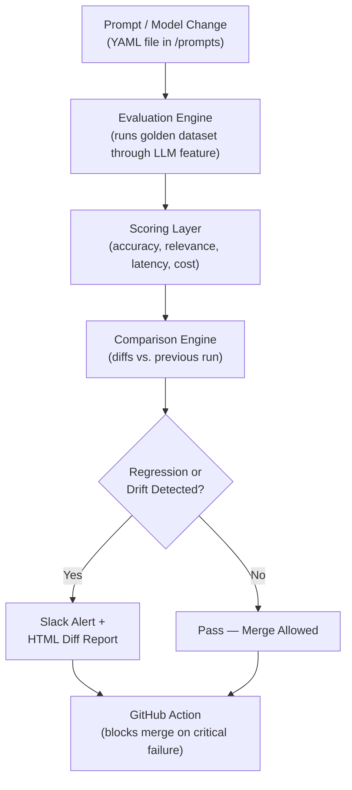
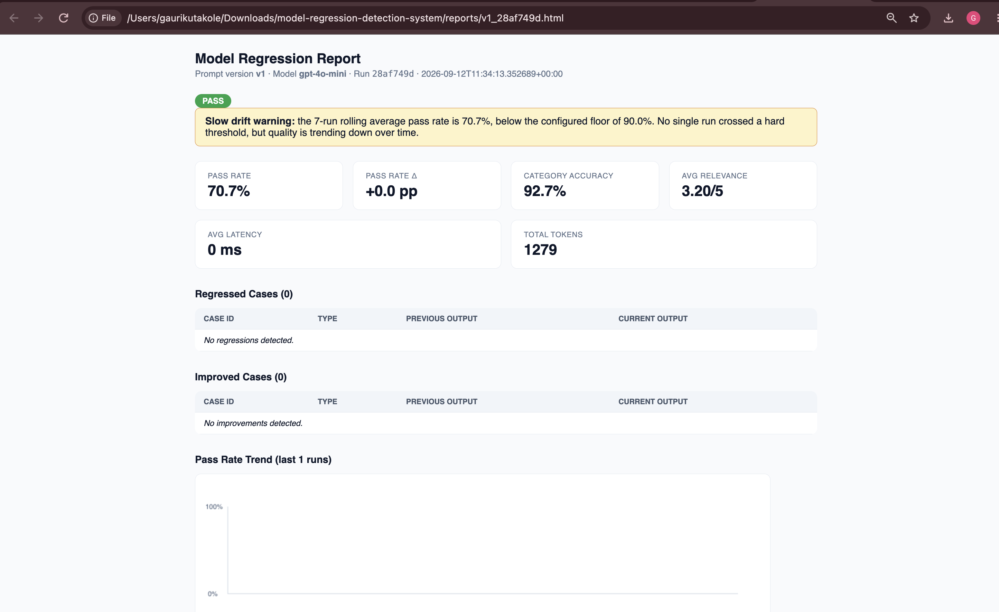
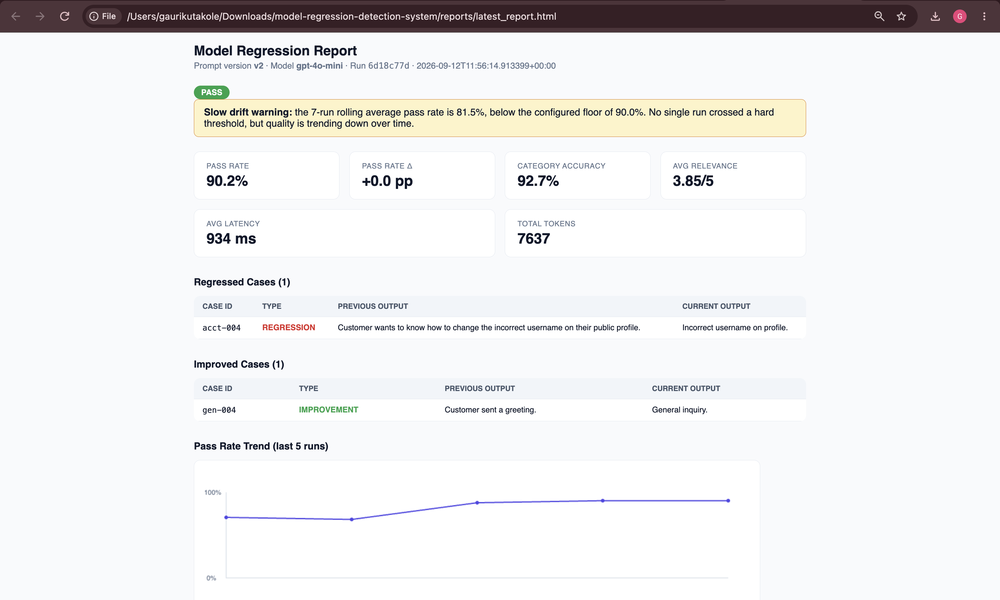
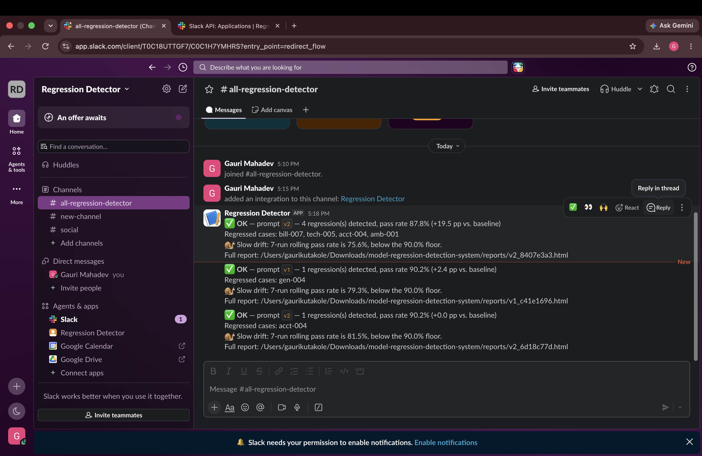

# Model Regression Detection System

**A CI/CD-style safety net for AI features** — it automatically re-tests any LLM-powered feature every time a prompt or model changes, catches quality drops before they reach users, and sends a plain-language alert to your team's Slack.

---

## Table of Contents

1. [Overview](#overview)
2. [Why This Project Exists](#why-this-project-exists)
3. [Architecture Overview](#architecture-overview)
4. [Technologies Used](#technologies-used)
5. [Installation Steps](#installation-steps)
6. [Usage Instructions](#usage-instructions)
7. [Generated Artifacts & Reports](#generated-artifacts--reports)
8. [Example Output](#example-output)
9. [Contribution Guidelines](#contribution-guidelines)
10. [Project Roadmap](#project-roadmap)
11. [License](#license)
12. [Further Reading](#further-reading)

---

## Overview

Modern products increasingly rely on large language models (LLMs) to power features like email classification, summarization, and chat assistants. The problem: every time someone tweaks a prompt or swaps a model, there's no reliable way to know if the feature got *better* or *quietly worse* — until a customer complains.

This project builds that missing safety net. It works like a continuous integration (CI) pipeline, but instead of testing code, it tests **AI behavior**. Every change to a prompt or model triggers an automatic evaluation against a hand-verified "golden dataset," and the system reports whether quality held steady, improved, or regressed — with the specific examples that changed.

**In plain terms:** think of it as a spell-checker for AI quality. It doesn't stop you from making changes — it just makes sure you *know* what those changes did before your users find out.

---

## Why This Project Exists

Most teams shipping AI features today are flying blind. A prompt gets edited to fix one bug, and three other cases silently break — nobody notices until a support ticket comes in. This project addresses that gap by:

- Testing every prompt/model change against a consistent, trusted dataset
- Measuring quality across multiple dimensions (accuracy, relevance, speed, cost) — not just "did it look right"
- Flagging both sudden regressions and slow, gradual drift over time
- Alerting the team automatically, in a channel they already check (Slack)

---

## Architecture Overview

The system is organized into five stages that mirror a typical software CI/CD pipeline, but applied to AI outputs instead of code.



**How the pieces fit together:**

| Stage | What Happens | Plain-Language Summary |
|---|---|---|
| 1. Trigger | A developer edits a prompt file | "Someone changed how the AI is instructed" |
| 2. Evaluation Engine | The updated feature runs against 50–100 hand-verified test cases | "We re-test the AI on questions we already know the right answers to" |
| 3. Scoring Layer | Each test case is scored on correctness, relevance, speed, and cost | "We grade the AI's homework on more than one criteria" |
| 4. Comparison Engine | New scores are compared to the last known-good run | "We check if grades went up, down, or stayed the same" |
| 5. Alerting & Reporting | If something got worse, Slack pings the team with a link to a detailed report | "We tell the team immediately, in the place they already look" |
| 6. CI/CD Gate | GitHub Actions blocks the pull request if a critical regression is found | "We don't let broken changes sneak into production" |

---

## Technologies Used

### Core Technical Stack

| Component | Tool / Library | Why It Was Chosen |
|---|---|---|
| Language | Python 3.11+ | Industry standard for ML and data tooling |
| LLM Provider | OpenAI API (GPT-4o / GPT-4o-mini) | Widely recognized, easy to swap for another provider later |
| Evaluation Framework | Custom scoring + RAGAS or DeepEval | Demonstrates evaluation beyond simple accuracy checks |
| Data Storage | SQLite + JSON files | No servers to manage; fully portable and version-controllable |
| Alerting | Slack Incoming Webhooks | The tool teams already use for notifications |
| Scheduling / CI | GitHub Actions | Runs automatically on every pull request, free for most use cases |
| Visualization | Streamlit or a static HTML report | A quick, readable dashboard for comparing runs |
| Containerization | Docker | Makes the whole system portable and production-ready |

### Non-Technical "Ingredients"

For stakeholders who don't work in code day-to-day, here's what those tools actually *do* for the project:

- **A test bank ("golden dataset")** — a curated set of realistic examples with known correct answers, similar to an answer key for a school exam.
- **A report card system** — every AI response gets graded, not just marked right or wrong.
- **An early-warning system** — the team is notified the moment quality starts slipping, instead of finding out from a customer.
- **A gatekeeper** — changes that fail the quality bar are stopped before they reach users.

---

## Installation Steps

These steps assume basic familiarity with a terminal. No prior AI/ML experience is required.

1. **Clone the repository**
   ```bash
   git clone https://github.com/gaurimk/model-regression-detection-system.git
   cd model-regression-detection-system
   ```

2. **Install Python dependencies**
   ```bash
   python -m venv venv
   source venv/bin/activate   # On Windows: venv\Scripts\activate
   pip install -r requirements.txt
   ```

3. **Set your environment variables**
   Create a `.env` file in the project root with:
   ```
   OPENAI_API_KEY=your_openai_key_here
   SLACK_WEBHOOK_URL=your_slack_webhook_url_here
   ```

4. **(Optional) Build the Docker container** if you'd rather not manage a local Python environment:
   ```bash
   docker build -t regression-detector .
   docker run --env-file .env regression-detector
   ```

5. **Verify the install** by running the unit test suite:
   ```bash
   pytest tests/ -v
   ```

6. **Run your first evaluation.** No API key is required — leaving `OPENAI_API_KEY` blank
   automatically runs the pipeline in **mock mode**, using a deterministic offline
   classifier so you can see the whole system work end to end at zero cost:
   ```bash
   python run_eval.py --prompt-version prompts/v1.yaml
   ```
   Then open `reports/latest_report.html` in a browser to see the scorecard.

   To see the diffing/regression-detection in action, run a second prompt version
   right after:
   ```bash
   python run_eval.py --prompt-version prompts/v2.yaml
   ```
   `v2` is intentionally tuned toward much shorter summaries, so this run will show
   at least one regression against the `v1` baseline in the console output and the report.

   When you're ready to use a real model, just set `OPENAI_API_KEY` (and optionally
   `OPENAI_MODEL`) in `.env` — no code changes needed.

---

## Usage Instructions

### Running an Evaluation Manually

```bash
python run_eval.py --prompt-version prompts/v3.yaml --dataset golden_dataset.json
```

This command runs every test case in the golden dataset through your current AI feature, scores the results, and compares them to the previous run.

### Adding a New Test Case

1. Open `golden_dataset.json`.
2. Add a new entry with a unique ID, the input, the expected output, and a difficulty label (e.g., `easy`, `edge_case`).
3. Save the file — it is version-controlled, so changes to the "answer key" are tracked over time.

### Adjusting Alert Thresholds

Thresholds live in `config.yaml`. For example:

```yaml
thresholds:
  warning_delta_percent: 3
  critical_delta_percent: 8
```

Raise these numbers to reduce alert sensitivity; lower them to catch smaller regressions.

### Viewing a Report

After any evaluation run, open the generated file at `reports/latest_report.html` in a browser. It includes a scorecard, a table of every case that changed, and a trend chart of recent runs.

### Automatic Runs via GitHub Actions

No action needed — once installed, every pull request that edits a file in `/prompts` automatically triggers an evaluation, posts a summary comment on the PR, and blocks merging if a critical regression is detected.

---

## Generated Artifacts & Reports

This project produces the following outputs each time it runs:

- **`reports/latest_report.html`** — A visual scorecard comparing the current run to the previous baseline, including a side-by-side view of any AI responses that got worse.
- **Trend chart** — A line chart tracking quality scores across the last several runs, useful for spotting slow, gradual decline that a single run wouldn't catch.
- **Slack notification** — A short message summarizing pass/warn/fail status (for example: *"3 regressions detected, accuracy dropped from 94% to 89%"*) with a link to the full report.
- **PR comment** — An automatically posted summary on GitHub pull requests showing whether the change is safe to merge.

These artifacts are designed to be understandable at a glance by non-technical stakeholders, while still offering full detail for engineers who need to debug a specific case.

---

## Example Output

Real output from a live run of this project, using the actual OpenAI API and a real Slack workspace — not mocked screenshots.

### HTML Report — Baseline Run (prompt v1)

The first evaluation run has nothing to compare against yet, so it's shown as a clean baseline: 70.7% pass rate, zero regressions, zero improvements.



### HTML Report — After a Prompt Change (prompt v2)

After switching to prompt `v2`, the report immediately shows what changed against the v1 baseline: 1 case regressed (`acct-004`), 1 case improved, and a slow-drift warning fired because the 7-run rolling average had dipped below the configured 90% floor — exactly the kind of gradual decline a single run alone wouldn't catch.



### Slack Alerts

Each evaluation run posts automatically to the configured Slack channel, with the pass/fail badge, the headline numbers, which specific test cases regressed, and a link to the full report — no one has to go looking for this information.



---

## Contribution Guidelines

We welcome contributions from developers of all experience levels.

1. **Fork the repository** and create a new branch for your change:
   ```bash
   git checkout -b feature/your-feature-name
   ```
2. **Follow existing code style** — the project uses typed Python (Pydantic models) and includes linting via `pre-commit`.
3. **Add or update tests** — if you change scoring logic or add a feature, include relevant test cases in the golden dataset.
4. **Run the full evaluation suite locally** before opening a pull request:
   ```bash
   python run_eval.py --dataset golden_dataset.json
   ```
5. **Open a pull request** with a clear description of what changed and why. Reference any related issues.
6. **Be responsive to review feedback** — we aim to review all PRs within a few business days.

If you're new to the project, look for issues labeled `good first issue`.

---

## Project Roadmap

- [ ] Expand golden dataset to cover additional languages
- [ ] Add support for additional LLM providers beyond OpenAI
- [ ] Build a lightweight Streamlit dashboard for historical trend exploration
- [ ] Add configurable notification channels beyond Slack (e.g., email, Microsoft Teams)

---

## License

This project is released under the MIT License. See `LICENSE` for details.

---

## Further Reading

- **[Architecture Deep-Dive](docs/ARCHITECTURE.md)** — module map and the reasoning behind key design decisions (why run history is shared across prompt versions, why regressions and drift are separate code paths, why a mock LLM client is a permanent feature, not a testing shortcut).
- **[Known Limitations](docs/LIMITATIONS.md)** — an honest account of what this project doesn't yet do well: dataset size, LLM-judge reliability, statistical significance, latency/cost measurement.
- **[Blog Post](docs/blog.md)** — the problem, the approach, and the design decision behind separating sudden regressions from slow drift.
- **[Changelog](docs/CHANGELOG.md)** — dated history of what's changed, including a bug fix worth knowing about (run history was originally split per prompt version, silently breaking cross-version diffing).
- **[Demo](docs/DEMO.md)** — a suggested script for a short walkthrough video.

---

*Questions or feedback? Open an issue on GitHub — we're glad to help onboard new contributors.*